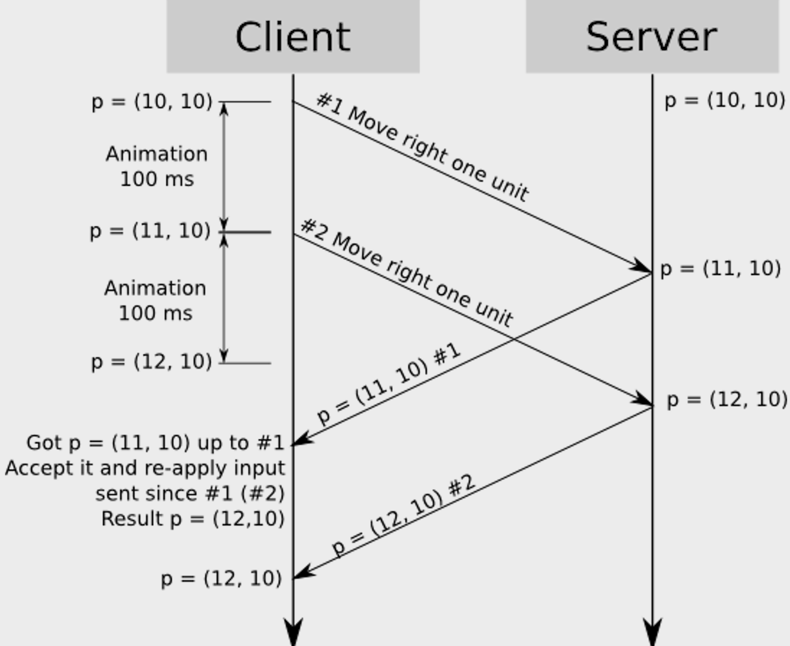

# CleintSidePrediction-Unity3D

Client-side prediction is a network programming technique used in video games intended to conceal negative effects of high latency connections. 
The technique attempts to make the player's input feel more instantaneous while governing the player's actions on a remote server.

## Example

### Example explanation

>1. You press move button
>1. You send your input command to server
>1. You simulate it behaviour (move) before getting confirmation from the server
>1. You pressing move button, send input and simulating it behaviour
>1. Recieving first input result from the server, place character in new place, repeat simulation only on remain inputs (second)

## Engine
> Unity

## NetCode

>Mirror `(Upgarded UnityNetCode)`
